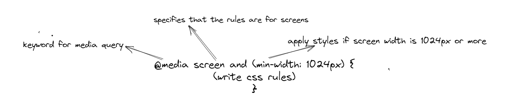
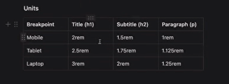
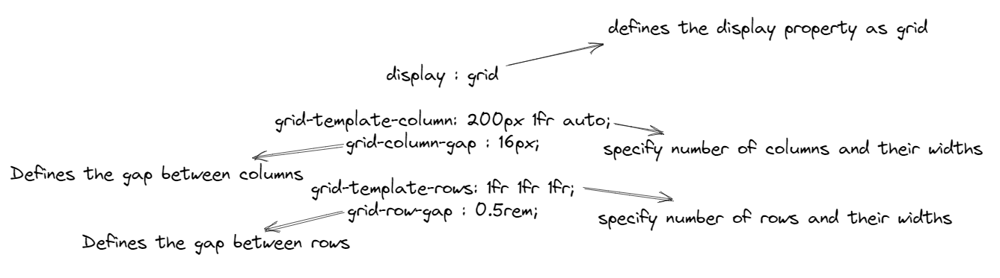
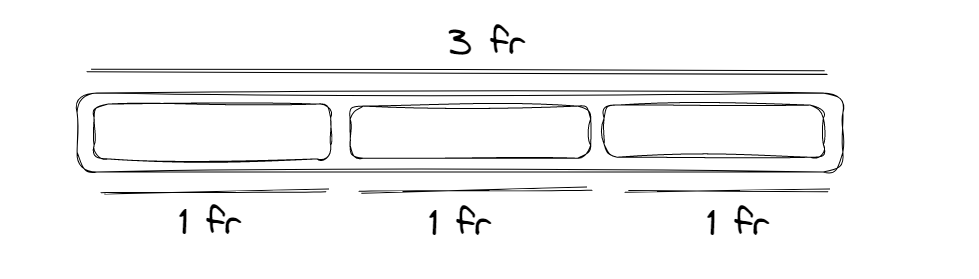
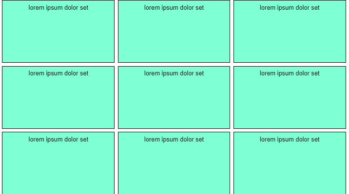
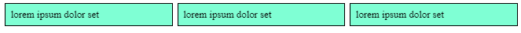
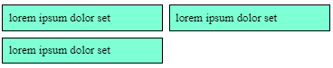

# RESPONSIVE DESIGNS

## What is responsive designs ?

- Responsive design refers to a site or application design that responds to the environment in which it is viewed (mobile/desktop/tablet).

- Responsive designing is designing based upon the screen size.

## Resposive design flow

Responsive design flow (for mobile first websites) -

mobile(max-users)> desktop> tablet(min-users)

Responsive design flow (for desktop first websites eg.Azure, AWS) -

desktop > mobile > tablet

## What is media query ?

- Uses the @media rule to include a block of CSS properties only if a certain condition is true.



## What is breakpoint ?

- A point where a screen changes its layout is called breakpoint.

- CSS breakpoints are points where the website content responds according to the device width, allowing you to show the best possible layout to the user. 

- CSS breakpoints are also called media query breakpoints, as they are used with media query.

> Common breakpoints are -
>
> - screen width >= 1024px- for desktops
> - 1024px > screen width >= 768px - for tablets
> - 768px > screen width >= 480px - for mobiles

## How does it work?

- We will first do default stlying that will be applicable to mobile.

- Then we define media queries for tablet that will be applied when a specific screen is applied.

- Then we define media queries for desktop.

```css
/* default styles for mobile*/
body {
  font-size: 14px;
}

/* styles for tablets (potraits) and up */
@media screen and (min-width: 768px) {
  body {
    font-size: 16px;
  }
}

/* styles for laptops and up */
@media screen and (min-width: 1024px) {
  body {
    font-size: 18px;
  }
}
```

### Explanation-

- By default(when there is no screen size matching the media queries) the font-size of the body will be14px.

- If the screen size is minimum 768px(tablet) or more then the font-size will get overridden to 16px.

- If the screen size is minimum 1024px(desktop) or more then then the font-size will get overridden to 18px.

## Example 1

- Make the background color of screen yellow.

- write media query that will change the background color to transparent when the screen size is more than 600px.

```css
body{
    background-color: yellow;
}

@media screen and (min-width: 600px) {
  body {
    background-color: transparent;
 }
}
```

## Explanation -

- By the rules of CSS, the styles of desktop will overwrite the default styles when the specified screen width is reached.

- Here, the mobile view will have yellow background whereas desktop view will have a transparent background.

- This is called mobile first design.
<hr/>


## Responsive typography 

- It is important to change the font size when the screen size varies.

- The font-sizes should be perfect on desktop so that the user can read the content.

- We should use relative units like rem for font-sizes.



> IMPORTANT NOTE:
>  1. The default styles will get overwritten if the same styles are specified in media query otherwise the default styles will be applied.
> 2. First always specify mobile or default styles and then speficity media query for tablet and then for desktop so that the styles can get overwridden when the specified screen width is reached.


# GRIDS

## What is grid ?

The CSS Grid Layout Module offers a grid-based layout system, with rows and columns, making it easier to design web pages without having to use floats and positioning.

### When to use grid and when to use flex?

- Grid is more useful for 2D layouts and flex is for 1D layouts.
- While designing the layout of whole page : USE GRID
- While designing Individual components/cards/tables/rows : USE FLEX

### Grid Syntax :-



- The grid-template-rows property specifies the number (and the heights) of the rows in a grid layout.

- The grid-template-columns property specifies the number (and the widths) of columns in a grid layout.

> Grid template row/grid template column can take units in 3 forms:-
>
> - Auto
> - Pixels
> - Fractions

### What is fr ?

- The fr unit represents a fraction of the available space in the grid container.
- 1fr is 100% of available space.
- 2fr is 50% of available space.
- 3fr is 33% of available space and so on.



#### Explanation

- Suppose the total width of page is 3fr (100%).

- If we specify 1fr width to each child then it will take the space equivalent to 1/3rd of total width (33.333%).

### Example 1 with grid -

Q- Create 3 rows with height 1fr each and create 3 columns with width 1fr each.

```html
<div className="parent">
  <div className="card">lorem ipsum dolor set</div>
  <div className="card">lorem ipsum dolor set</div>
  <div className="card">lorem ipsum dolor set</div>

  <div className="card">lorem ipsum dolor set</div>
  <div className="card">lorem ipsum dolor set</div>
  <div className="card">lorem ipsum dolor set</div>

  <div className="card">lorem ipsum dolor set</div>
  <div className="card">lorem ipsum dolor set</div>
  <div className="card">lorem ipsum dolor set</div>

  {/*
  <div className="card">lorem ipsum dolor set</div>
  <div className="card">lorem ipsum dolor set</div>
  */}
</div>
```

```css
.parent {
  font-family: sans-serif;
  display: grid;
  grid-template-columns: 1fr 1fr 1fr;
  grid-column-gap: 0.5rem;
  grid-template-rows: 1fr 1fr 1fr;
  grid-row-gap: 0.5rem;
  height: 500px;
}

.card {
  background-color: aquamarine;
  border: 1px solid black;
  padding: 0.5rem;
}
```

### Output-



### Explanation :-

- In the above example, we created a parent div with class(parent) and created 9 child divs with class(card).

- now we have specified display:grid to the parent div.

- Now we have specified grid-template-columns: 1fr 1fr 1fr which means create 3 columns with width of 1fr each.

- Similarly we have specified grid-template-rows: 1fr 1fr 1fr which means create 3 columns with height of 1fr each.

- We have created a gap of 0.5 rem each between rows and columns.

## The repeat() notation

- Repeat() is a notation that you can use with the grid-template-columns and grid-template-rows properties to make your rules more concise and easier to understand when creating a large amount of columns or rows.

- Repeat() repeats a value for a certain number of times.

#### Creating rows/columns without using repeat()

```css
.container {
  display: grid;
  grid-template-columns: 1fr 1fr 1fr;
  grid-template-rows: 200px 200px 200px;
}
```

#### Creating rows/columns using repeat()

```css
.container {
  display: grid;
  grid-template-columns: repeat(3, 1fr);
  grid-template-rows: repeat(3, 200px);
}
```

## Making Grids Responsive

Question - Place 3 cards in parent container, on desktop, 3 cards must be visible and on mobile there should be 2 cards visible.

```html
<div className="grid-row">
  <div className="card">lorem ipsum dolor set</div>
  <div className="card">lorem ipsum dolor set</div>
  <div className="card">lorem ipsum dolor set</div>
</div>
```

```css
.grid-row {
  display: grid;
  grid-template-columns: repeat(2, 1fr);
  grid-template-columns: 1fr 1fr;
  grid-gap: 0.5rem;
}

.card {
  background-color: aquamarine;
  border: 1px solid black;
  padding: 0.5rem;
}

/* Desktop - Three cards per row */
@media (min-width: 600px) {
  .grid-row {
    grid-template-columns: repeat(3, 1fr);
  }
}
```

## Ouput for desktop -



## Ouput for mobile -



### Explanation -

- In the above code , we have created a parent with class (grid-row) and 3 child with class (card).

- By default(for mobile) we have specified grid-template-columns as repeat(2, 1fr) which means display 2 columns with width 1 fr each.

- With the help of media query we have specified that if screen width goes beyond 600px(for desktop) then overwrite grid-template-columns with repeat(3, 1fr) which means display 3 columns with width 1 fr each.
