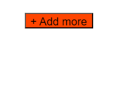

## CSS basics (1)

## CSS Terminologies


### **_Selector :_** 

Selector is used to specifically target a particular html element.

#### Types of selectors:

**_class selector:_** Class selectors are used to target html elements having a class.They are initiated by dot(.).

**_ID selector:_** Id selectors are used to target html elements having an Id.It is prefered to use single id for each html element.They are initiated by hash(#).

**_element selector:_** Element selectors are used to directly target the html elements and style them.

### **_Declaration :_** 
Declaration is denoted by {}.Declaration helps in initialising the style properties and values for a selector.

### **_Properties :_** 
Properties are declared inside the declaration.Properties indicates the styles that we have to apply to the selector.

Margin, padding, color, background-color are the examples of properties.

### **_Values :_** 
Values are assigned to the properties.

For example, margin : 2px, margin is the property with the value 2px.

```CSS
font-size: 40px;
color: green;

// font-size and color are the properties and 40px and green are the values of the respective property.

```

### **_Rule :_** 
The combination of selector, declaration along with its properties and values is known as a rule.

```CSS
// Example of rule -->

.container css selector declared with property color having value red

.container {
  color: red;
}
```

## What does CSS stands for?

> **_Cascading style sheets (CSS)_**

## What is the meaning of cascade?

Process of combining different stylesheets and resolving conficts between CSS rules and declarations.

## What are the different sources of style sheets:-

### Author/Developer Defined Styles-

- The styles that are assigned by the developer are called as author defined styles.

### User Defined Styles-

- The styles that are assigned by the website user as known as user defined styles.

- Older versions of the browsers has the ability to provide users an option to apply style sheets to the website.

- In modern browsers , we can change the font-size through settings which is also an example of user defined style sheets.

### Default Styles-

- The browser assigns some default styles to the html elements.

- These type of style sheets are also known as user-agent style sheets as the user agent is browser which is assigning the default styles.

- For example, a link is always blue in color and a button is always grey in color.

### What is the preference order of different style sheets?

**_User Defined Styles > author Defined Styles > Default Styles_**

> The first priority will be given to user defined styles, then the author defined styles and finally the default styles from the browser.


## What are pseudo classes and pseudo elements?

### Pseudo Classes

1. A pseudo-class is used to define a special state of an element.
2. Can be used to style an element when a user mouses over it

3. Can be used to style visited and unvisited links differently.

4. Can be used to style an element when it gets focus.

Examples -

- :hover          
- :enabled        
- :disabled       
- :checked        
- :visited
- :active
- :focus
- :link
- :lang
- :target
- :focus


### Pseudo elements
1. A CSS pseudo-element is used to style specified parts of an element.

2. it can be used to style the first letter, or line, of an element

3. Can be used to insert content before, or after, the content of an element.

Examples -

- :after
- :before 
- :first-letter
- :selection
- :first-line
- :marker 

## What is the order of styling applied ?


### !Important

- !Important has the highest specificity.

- The !important rule in CSS is used to add more importance to a property/value than normal.

- In fact, if you use the !important rule, it will override ALL previous styling rules for that specific property on that element!

Example :-

```html
Index.html

<body>
  <p>This is some text in a paragraph.</p>

  <p class="myclass">This is some text in a paragraph.</p>

  <p id="myid">This is some text in a paragraph.</p>
</body>
```

```CSS
Style.css

#myid {
  background-color: blue;
}

.myclass {
  background-color: gray;
}

p {
  background-color: red !important;
}
```

**_Output :_**


**_explanation :_**
In the example above. all three paragraphs will get a red background color, even though the ID selector and the class selector have a higher specificity.

The !important rule overrides the background-color property in both cases.

### What is the order in !important in terms of style sheet sources?


> if property in user style sheet has !important and author style sheet has !important as well for the same property then user style sheet property will get the priority .

> if property in user style sheet does not have !important and author style sheet has !important the same property then author style sheet property will get the priority .

### Specificity

- If there are two or more CSS rules that point to the same element, the selector with the highest specificity value will "win", and its style declaration will be applied to that HTML element.

- Specificity is a score that determines which style declaration is ultimately applied to an element.

Examples:-

```html
Example 1- Index.html

<body>
  <p id="paragraph" class="paraClass">Hello World!</p>
</body>
```

```CSS
  <style>
    #paragraph {color: blue;}
    .paraClass {color: green;}
    p {color: red;}
  </style>
```

**_Output :_**


**_explanation :_**
In this example, we have added the id selector (named "paragraph"). The text will now be blue, because the id selector is given higher priority.

### What is the order in specificity?


### How to calculate specificity?

Every CSS selector has its place in the specificity hierarchy.

There are four categories which define the specificity level of a selector:

- **_Inline styles_**- Example: `<h1 style="color: pink;">`

- **_IDs_**- Example: #navbar

- **_Classes, pseudo-classes, attribute selectors_** - Example: .test, :hover, [href]

- **_Elements and pseudo-elements -_**- Example: h1, ::before

There are 4 components of specificity.

> **\*Formula :\*\*** (no. of Inline styles, no. of IDs, no. of Classes/pseudo-classes/ attribute selectors, .no of Elements/pseudo-elements)

**_explanation :_**

Start at 0, add 100 for each ID value, add 10 for each class value (or pseudo-class or attribute selector), add 1 for each element selector or pseudo-element.

> Note 1: Inline style gets a specificity value of 1000, and is always given the highest priority!

> Note 2: There is one exception to this rule: if you use the !important rule, it will even override inline styles!

> Note 3: Specificity is always calculated from left hand side.

## Examples of specificity

Example 1 :-

```HTML
***index.html***

<body>
    <div class="container">
      <div class="row">
        <div class="col-lg-6">
          <p class="text-muted">
            Lorem ipsum dolor sit amet, consectetur adipiscing elit.
          </p>
        </div>
      </div>
    </div>
    <p class="text-muted">This is a global paragraph.</p>
  </body>

***style.css***

Example 1:
p {
  font-size: 24px;
}
/*specificity:- (0,0,0,1) */


Example 2:
.row .text-muted {
  font-weight: bold;
}
/*specificity:- (0,0,2,0) */

```

**_explanation of example 1:_** In the above example 1 there is no inline styling, there is no id selector, there is no class selector.It only has an element selector(p) which takes the last place hence specificity is (0, 0, 0, 1).

**_explanation of example 2:_** In the aboc=ve example 2 there is no inline styling, there is no id selector, there are 2 class selector hence 2 initiated by dot(.row & .text-muted).There is no element selector hence specificity is (0,0,2,0).

```HTML
***index.html***

 <body>
    <div class="container" id="app">
      <div class="row">
        <div class="col-lg-6">
          <p class="text-muted">
            This paragraph has some muted text
          </p>
          <p class="text-muted lead">
            Muted text paragraph with a lead
          </p>
          <button class="btn btn-primary">Add more</button>
        </div>
      </div>
    </div>
    <p class="text-muted">This is a global paragraph.</p>
  </body>

***style.css***

Example 3:
.lead::first-letter {
  font-size: 24px;
}
/* specificity (0,0, 1, 1) */


Example 4:
p:nth-of-type(2):before {
  content: "Note: ";
}
/* specificity (0,0,1,2) */

```

**_explanation of example 3:_** In the above example 3 there is no inline styling, there is no id selector, there is 1 class selector(.lead).Also there is 1 element selector(first-letter) which takes the last place hence specificity is (0,0, 1, 1).

**_explanation of example 4:_** In the above example 4 there is no inline styling, there is no id selector, there is 1 class selector (nth-of-type(2)).There is a pseudo-element(before) and element selector(p)hence specificity is (0,0,1,2).

## Source order

If the specificity for the property is same, then the rule coming at the end will get the priority.

Example,

```HTML

Index.html

 <div class="container" id="app">
<button class="btn btn-primary">Add more</button>
</div>

Style.css

.btn {
  background-color: blue;
}
specificity - (0, 0, 1, 0)

.btn-primary {
  background-color: orangered;
}
specificity - (0, 0, 1, 0)
```

**_Output_**



**_Explanation :_**

- In the above example, we created a button with 2 classes namely .btn and .btn-primary.

- Now in style.css we have targeted both the classes individually using class selector and gave it a property of background color.

- Now, the property background-color will have same specificity in both the rules that is (0, 0, 1, 0).

- But since the class selector with (.btn-primary) is coming later, the background-color property will be more specific and hence will be applied.

## Important Thing to keep in mind

> Specificity is about a conflicting property and not about conflicting rule.

> Specificity comes in action when 2 or more rules have conflicting properties.The rule which is having the higher specificity will get the priority in terms of conflicting properties.

> Cascading is applied on each properties and not on rule.

Example-

```HTML

index.html

 <div class="container" id="app">

<button class="btn btn-primary">Add more</button>

</div>


style.css

#app .btn.btn-primary:hover {
  color: yellowgreen;
}

specificity - (0, 1, 3, 0)

.btn:hover {
  color: darkviolet;
  font-size: 24px;
}
specificity - (0,0,2,0) 
```

**_Output :_**


**_Explanation :_**

- In the above code , we have created a div with id="app".Within this div we have a button with 2 classes ("btn" &"btn-primary")

- In style.css, we have targeted button using 2 different rules.

- Both the rules have the conflicting property which is color whereas an additional propery of font-size inside rule with class selector as (.btn:hover).

- Now since rule with class selector (#app .btn.btn-primary:hover) has more specificity as compared to class selector as (.btn:hover), the rule with selector (#app .btn.btn-primary:hover) will take the value of conflicting property that is blue due to its higher specificity.

- Since, font-size is not a conflicting property, it will still be applied on hover.