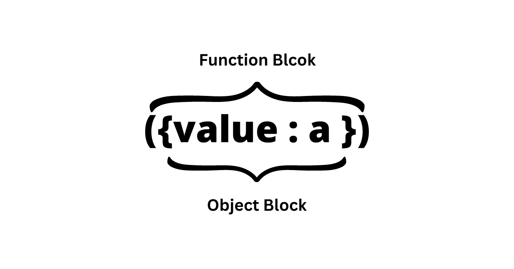

# ES6 - Part 1

## What does ES6+ means?

- JavaScript ES6+ is a **newer version of the JavaScript programming language** that includes many new features and syntax improvements. These additions make it easier to write efficient and readable code, which can help create better web applications.
- **ES6+ stands for ECMAScript 6 and beyond**, where ECMAScript is the official name for the language specification that JavaScript is based on.

## Topic: let, const & var


## Arrow Function 

Arrow function is a syntax introduced in ES6. It is an easier way of writing functions, especially if its a one liner function that returns something.

### Let us first see how a function was created in ES5

Example, The below function takes in a and b as parameters and returns the sum of a and b.  

```
function sum ( a,b ) { 
return a+b; }
```

### Let us see how a function was created in ES6

```
const sum = ( a,b ) => { return a+b; } 
```

>Arrow function is an introduction in ES6 that makes the code more readable. 

## How to convert ES5 function to ES6 ?

1. Instead of function keyword , add variable type.It is recomended to use const as functions are not reassigned.

2. After that add the function name , followed by =.

3. Now , if there are 2 or more parameters then close them in () else if there is single parameter then you can skip ().

4. Add => arrow function symbol.

5. Now open curly brackets {} and return the output else skip {} and return if there is single return statement.

```
ES5 function :-

function sum ( a,b ) { 
return a+b; }

ES6 function :-

const sum = ( a,b ) => { return a+b; }
```


### Variations of Arrow Function

-If you use { } in arrow function, you need to use return to return a value that you want. 

```
function add10To(num) {
	return num + 10;
}
```


-If there is just one line to return we don’t need to use {} and return . Arrow function automatically does that.

```
const add10To = (num) => (num + 10)
```

-If there is only one parameter, we don’t need to use () in parameter as well as in return statement.

```
const add10To = num => num + 10;
```

### Arrow function for objects

If there is single object that has to be returned then it should be done as :-

```
const objFuncs = a => ({value: a});
```

Here, () were used for 1 line as well because, the objects {} might be understood as function blocks, therefore to let the JS know, that these are object’s bracket and not function’s. {} are used.

**Explanation**


>If we use {} the compiler would misinterpret it with a return curly braces rather than considering it as object, hence we use ( ) brackets. The curly braces here would be use for the object and the outer bracket ( ) would be used for function block.




## Default parameters

-With the help of ES6, we can pass a default parameter in case one or more parameter is missing in a function.

-With the introduction of default parameters we can set the default value of parameters which will be used when only a single argument is passed.

```
function sum(a,b) {
	return a + b;
}
console.log(sum(2)); // Output: NaN
```

>In the above function if we pass only one argument then it can return an error because we have not passed b as argument and there is no default value for b.

#### ES5 way to add default parameter 

```
const sum = ( a,b ) => { 
    if(b==undefined) { b=0 } 
    return a+b; } 
```
>In the above code we have initialised b with 0 if the b parameter is undefined or does not exist.

#### Lets see ES6 way to add default parameter

```
const sum = (a, b=0) => a+b 
```

>Here as we can see, since only argument is passed to the function, the function used the default value of second parameter which is b=0 and adds 2+0 and returns the sum value 2. 

### What if we pass argument as we as default parameter ?

If both the arguments are passed then the default value will not be used. Instead the passed argument value will be used. 

```
const productFunc = (a, b = 2) => {
    return a * b
}

console.log(productFunc(2, 4))
// output - 8
```

>In the above example, we can see that, the default value of 2 is ignored and the argument passed that is 4 is utilized. Here 2 and 4 is multiplied to give result of 8. Instead of 2 and default value = 2 multiplication.

### How can we pass default parameter for first argument ?

```
If we want to set a default value to the first argument, this is the way 

const multiply = (a=3,b) => a*b;
console.log(multiply(,2)); // it gives syntax error

// correct way
const multiply = (a=3,b) => a*b
console.log(multiply(undefined,2)); // output would be 6
```

>**Note :**  We have to pass undefined if we want to set a default value to the first argument.