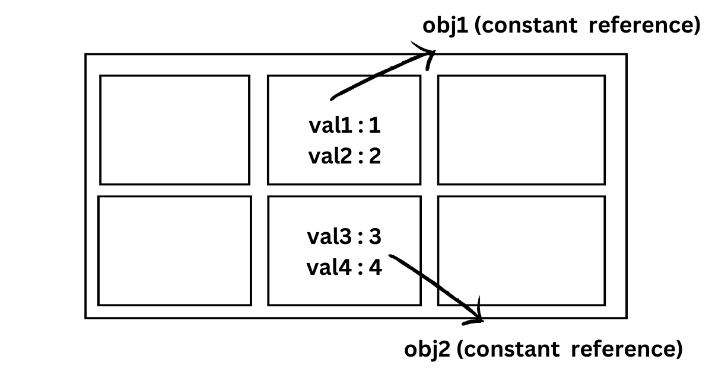

# ES6 - Part 1

## What does ES6+ means?

- JavaScript ES6+ is a **newer version of the JavaScript programming language** that includes many new features and syntax improvements. These additions make it easier to write efficient and readable code, which can help create better web applications.
- **ES6+ stands for ECMAScript 6 and beyond**, where ECMAScript is the official name for the language specification that JavaScript is based on.

## Topic: let, const & var

### What are let, const & var?

- `let`, `const`, and `var` are all ways to declare variables in JavaScript.

- **`let`** is used to declare a variable that can be reassigned to a new value. This means that the value of the variable can be changed throughout the code.

- **`const`** is used to declare a variable that cannot be reassigned to a new value. This means that the value of the variable remains the same throughout the code.

- Redeclaration of variables declared with `let` & `const` keywords results in a `SyntaxError` whereas variables redeclared with `var` keyword will override the previous declaration.

`const` value cannot be changed. Reassigning value to `const` not possible by definition.

```js
{
const c;
const a = 25;
const a = 26; // re-assigning is not possible
}
```

Here `a` is a variable and `const` is a keyword used for variable declaration.

### Scopes in javascript

- Types of Scopes in JavaScript:

- Block scope: Variables that are declared inside a { } block cannot be accessed from outside the block.

- Function scope: Variables defined inside a function are not accessible from outside the function. Each function creates a new scope.

- Global scope: Variables declared Globally (outside of any function) have Global Scope and Global variables can be accessed from anywhere in a program.


What is the scope of var, let, and const?

1. `var` can be global/functional scoped and it is used for variables that need to be redeclared and updated.

2. `let` is block-scoped and can be updated but not redeclared.

3. `const` is also block-scoped but it can't be updated or redeclared.

> ### Why use let & const over var?
>
> let and const provide block scoping, and variables declared using these keywords cannot be redeclared within the same scope. Attempting to redeclare a variable will result in a syntax error.
> With var, redeclaring a variable in the same scope is allowed and will simply override the previous declaration, potentially causing unexpected behavior in your code.

> ### Why is `const` preferred over `let`?
>
> `const` is preferred over `let` for variable declaration because `let` allows the variable to be re-assigned. Now this can be a problem because, if the same variable is re-declared and re-assigned for some other unknown reason, the functioning of the program or understanding of the program may become difficult or it can give unexpected results.

### Lets understand scopes with example

```JS
// code example 01
    if(true){
	var a = 2;
	let b = 3;
console.log(b); // Output: 3
}
console.log(a); // Output: 2
```

Let works only inside those brackets {..} and not outside. These {...} are called blocks, where code is written and let is block scoped. That means variable declared inside a block using let is not accessible outside the block, while using var → it can be accessed.

```JS
// code example 02
if(true) {
	let a = 2;
	// var a = 2;
}
console.log(a) // reference error
```

In this example when console.log tries to log the value of a, it cannot access it. To understand this, recollect block scope for let keyword . The code above gives a reference error.

### How to redeclare variables?

Here `a` was reassigned the value of `100`, So `42` was printed. Here `a` is declared outside so it can be accessed inside, if it would have been declared inside, it couldn’t have been accessed outside. Similarly `const` keyword is used for declaring, however we **can’t reassign** a value to `const` ⇒ It will throw an **error!**

```jsx
const a = 100;
function App() {
  a = 42;
  console.log("1", a); // TypeError: Assignment to constant variable.
}
App();
```

**What would happen, if we used `var`?**

```jsx
function something() {
  console.log(a); // Output: undefined.
  var a = 2;
}

something();
```

Here `var` does not gives reference error instead gives undefined. This is called hoisting, which we will study later. If we used `let/const` it would have given an error.

> ### Key Takeaway :

1. Always use `const` unless required otherwise
2. Use `let` when you want to change the value
3. Define all variables at the top of the scope
4. Name your variables differently
5. Stop using `var` from now on

## Temporal Dead zone (TDZ)

> A `let` or `const` variable is said to be in a "temporal dead zone" (TDZ) from the start of the block until code execution reaches the line where the variable is declared and initialized.

> While inside the TDZ, the variable has not been initialized with a value, and any attempt to access it will result in a `ReferenceError`.

> The variable is initialized with a value when execution reaches the line of code where it was declared. If no initial value was specified with the variable declaration, it will be initialized with a value of `undefined`.

> This differs from `var` variables, which will return a value of `undefined` if they are accessed before they are declared

Lets understand it with an example:-

```
example 1
function practice(){
console.log(a);
let a = 10;
}
practice();

output -->
Uncaught ReferenceError: Cannot access 'a' before initialization
    at practice (<anonymous>:2:13)
    at <anonymous>:5:1
```

**Explanation:**

The Code resulted in a ReferenceError. This is because variables declared using let keyword are subjected to Temporal Dead Zone.

Let and Const does not support hoisting in JavaScript. Therefore the variable cannot be hoisted and as a result it gives a ReferenceError.

> **Always declare first, then access it**

```
example 2
let a = 100;
function App() {

// first test
	console.log("1",a);

// second test
  let a = 42;
	console.log("2",a);

// third test
	{
		let a = 100; // not accesible outside this.
	}
	console.log("3",a);
}
```

**In the first test,**, a reference error will be popped up as a is not declared and we are still trying to access it.This is due to temporal dead zone concept, we cannot access the value of a.You cannot access a before initialising and this comes under the concept of TDZ.

**In the second test,** since the value of `a` is defined so it will `console.log` the value as 42.

**In the third test,** the variable `a` is declared within the {} parenthesis which will create a block scope so it is only accessible inside and not outside .Previously `let a=42` is already declared, therefore `console.log("3",a)` will fetch the a declared outside the {} block scope.

## Hoisting

- JavaScript Hoisting refers to the process whereby the interpreter appears to move the declaration of functions, variables or classes to the top of their scope, prior to execution of the code.

- Variables declared with `var` keyword (which makes them function scoped) are hoisted which means they are moved on top of their scope before the code is executed and initialized with the value of `undefined` instead of being the subject of the TDZ.
- These variables when accessed before the user assigns the value to it returns `undefined` instead of throwing an error.

Let's understand it with the help of example -

```JS
function practice(){
console.log(a);
var a = 10; // let is replaced by var
}
practice();


OUTPUT --> undefined
```

**Explanation:**

Since the a variable is declared with var, the output gets changed to undefined. This is because, var supports hoisting whereas let and Const don’t. variables declared with var are hoisted at the top of the scope, and as a result it holds a value undefined.

## Const with Objects

Lets suppose we have an object :

### EXAMPLE 1

```JS

const obj = {val1:1, val2:2};
obj.val2 = 25;
```

even though the above object is assigned using const we are able to update/This happens because in JavaScript, object is created using reference to a memory location. Here it creates a constant reference the the object obj. The compiler allows us to updated or modify the property of the object.


### EXAMPLE 2

```js
const obj1 = {val1:1, val2:2};
const obj2 = {val3:3, val4:4};
obj1 = obj2

// OUTPUT

VM702:3 Uncaught TypeError: Assignment to constant variable.
    at <anonymous>:3:6

```

**Explanation**
In the above code, 2 different constant reference were created for obj1 and obj2.Now since the objects are initiated with const, we cannot change their constant reference.In line 3rd, we are forcing to change the reference of the obj2 to obj1, and that’s why the compiler shows an error.



### EXAMPLE 3

```js
const obj3 = { val1: 1, val2: 2 };
const obj4 = { val1: 1, val2: 2 };
obj3 === obj4;

OUTPUT-- > false;
```

**Explanation**

Both are pointing to two different references of the memory location even though the key-value properties of both the objects obj3 and obj4 are same.


### EXAMPLE 4

```js
const obj1 = { val1: 1, val2: 2 };
const obj2 = obj1;
obj1 === obj2;

OUTPUT-- > true;
```

**Explanation**

In the obj1, we are first allocating a constant reference in the memory.Now we will create another object called obj2 which is pointing to the same reference of obj1.Hence the output is true.


## Const with Arrays

### Example 1

```
const array = [1,2,3];
array.push(7);

// output - 4
```

**Explanation**

In the above example we created a reference in memory of the array.In the same reference we are just pushing another value in the array.The output is 4 because push returns the new length of array.


### Example 2

```
const array = [1,2,3];
arr = array.pop();

// output - 
Uncaught TypeError: Assignment to constant variable.
    at <anonymous>:2:5

```

**Explanation**
Since we initialised array with const, it will create a memory reference for it.In the next line we are using pop() method but along with that we are also trying to change the reference of array.Since we are trying to reassign a constant array with modified array (array.pop()) this code is giving error.


> ### Summary:

- `var` has global scope while `let` has block scope. That means `var` can be accessed outside a block but `let` can’t be.
- `var` and `let` both are function scoped ⇒ that means if the variable is declared using `var/let` inside a function ⇒ It can’t be accessed outside the function.
- `var` is hoisted globally, that means it will give undefined if it is accessed before its value is assigned.
- `let` and `const` will give an error that you won’t be able to access before initialize. They are hosted in something called `TDZ` or Temporal Dead Zone.

## Arrow Function

Arrow function is a syntax introduced in ES6. It is an easier way of writing functions, especially if its a one liner function that returns something.

### Let us first see how a function was created in ES5

Example, The below function takes in a and b as parameters and returns the sum of a and b.

```js
function sum(a, b) {
  return a + b;
}
```

### Let us see how a function was created in ES6

```js
const sum = (a, b) => {
  return a + b;
};
```

> Arrow function is an introduction in ES6 that makes the code more readable.

## How to convert ES5 function to ES6 ?

1. Instead of function keyword , add variable type.It is recomended to use const as functions are not reassigned.

2. After that add the function name , followed by =.

3. Now , if there are 2 or more parameters then close them in () else if there is single parameter then you can skip ().

4. Add => arrow function symbol.

5. Now open curly brackets {} and return the output else skip {} and return if there is single return statement.

```js
ES5 function :-

function sum ( a,b ) {
return a+b; }

ES6 function :-

const sum = ( a,b ) => { return a+b; }
```

### Variations of Arrow Function

-If you use { } in arrow function, you need to use return to return a value that you want.

```js
function add10To(num) {
  return num + 10;
}
```

-If there is just one line to return we don’t need to use {} and return . Arrow function automatically does that.

```js
const add10To = (num) => num + 10;
```

-If there is only one parameter, we don’t need to use () in parameter as well as in return statement.

```js
const add10To = (num) => num + 10;
```

### Arrow function for objects

If there is single object that has to be returned then it should be done as :-

```js
const objFuncs = (a) => ({ value: a });
```

Here, () were used for 1 line as well because, the objects {} might be understood as function blocks, therefore to let the JS know, that these are object’s bracket and not function’s. {} are used.

**Explanation**

> If we use {} the compiler would misinterpret it with a return curly braces rather than considering it as object, hence we use ( ) brackets. The curly braces here would be use for the object and the outer bracket ( ) would be used for function block.


## Default parameters

-With the help of ES6, we can pass a default parameter in case one or more parameter is missing in a function.

-With the introduction of default parameters we can set the default value of parameters which will be used when only a single argument is passed.

```js
function sum(a, b) {
  return a + b;
}
console.log(sum(2)); // Output: NaN
```

> In the above function if we pass only one argument then it can return an error because we have not passed b as argument and there is no default value for b.

#### ES5 way to add default parameter

```js
const sum = (a, b) => {
  if (b == undefined) {
    b = 0;
  }
  return a + b;
};
```

> In the above code we have initialised b with 0 if the b parameter is undefined or does not exist.

#### Lets see ES6 way to add default parameter

```js
const sum = (a, b = 0) => a + b;
```

> Here as we can see, since only argument is passed to the function, the function used the default value of second parameter which is b=0 and adds 2+0 and returns the sum value 2.

### What if we pass argument as we as default parameter ?

If both the arguments are passed then the default value will not be used. Instead the passed argument value will be used.

```JS
const productFunc = (a, b = 2) => {
    return a * b
}

console.log(productFunc(2, 4))
// output - 8
```

> In the above example, we can see that, the default value of 2 is ignored and the argument passed that is 4 is utilized. Here 2 and 4 is multiplied to give result of 8. Instead of 2 and default value = 2 multiplication.

### How can we pass default parameter for first argument ?

```js
If we want to set a default value to the first argument, this is the way

const multiply = (a=3,b) => a*b;
console.log(multiply(,2)); // it gives syntax error

// correct way
const multiply = (a=3,b) => a*b
console.log(multiply(undefined,2)); // output would be 6
```

> **Note :** We have to pass undefined if we want to set a default value to the first argument.

## Destructuring and restructuring

Destructuring allows us to extract values from arrays & objects and assign them to variables in a more concise and readable way.

### ES5 way to get values from object

```JS
const newObj = { a:23, b:22 }

Now if we have to access a and b we will need to write
Now if we have to access a and b we will need to write

console.log(newObj.a);
console.log(newObj.b);
```

### ES6 way to get values from object

```js
const user = { name: "Rohan", age: "20" };
const { name, age } = user;
```

> We can rename the object properties in an object and can use them in future using **Restructuring**.

```JS
const user = {name: "Rohan", age: "20"};

const { name: userName, age: userAge } = user;  // restructuring
```

> In the above example, we first destructured name and age property from user object and then reassigned it with userName and userAge.

> See, the above variables name and age were changed to userName and userAge using restructuring.

### How to destructure arrays ?

Arrays can be destructured by using [] and then assigning a variable into it.

The order of the variables during destructuring corresponds to each value of array.

```JS
const [ a, b ] = [1,2,3,4,5,6,7,8,9,10];
console.log(a); //1
console.log(b); //2


const [ a, b, ...c ] = [1,2,3,4,5,6,7,8,9,10];
console.log(a); //1
console.log(b); //2
console.log(c); //[3,4,5,6,7,8,9,10]
```

> Destructuring can also be done in function parameters as well

```JS
const spreadExample = ({ a, b }) => {
  console.log(a, b)
}

const obj = { a: 1, b: 2 }
console.log(spreadExample(obj))
```

> In this code we have destructured a and b property from obj object while passing them as parameters.

## Rest and Spread Operators


### Rest

- With the Rest parameter, we can create functions that can take in a variable number of arguments. These arguments are stored in an array, which can be accessed from within the function.

- indicated by the use of the spread operator followed by a parameter name with three dots `(...parameterName)`.

```JS
const restExample = (a, ...rest) => {
    console.log(a, rest);
}

console.log(restExample(2, 3, 4, 5, 6, 7, 8, 9, 10));
```

The output would be 2 [3, 4, 5, 6, 7, 8, 9, 10].

In the above example, a was assigned to first value of array that is a and rest of the array items will be stored in rest array with the help of rest operator(...).

### Spread

- The output would be `2 [3, 4, 5, 6, 7, 8, 9, 10]`.

- The spread operator is a way to copy the contents of one array or object into a new array or object, by using three dots (**`...`**) followed by the original array or object. example:

```JS
const myArray = [1, 2, 3];

const newArray = [...myArray, 4, 5, 6];

console.log(newArray); // Output: [1, 2, 3, 4, 5, 6]
```

In the above example , we have created a newArray array by first spreading(copying) the values of myArray array and added 2 more values that is 4 and 5.

### Difference between rest and spread

1. Rest will always be used in left side and spread on right side of assignment operator during destructuring.

2. Rest will be used as a parameter in function definition, whereas spread will be used in argument while passing as to pass separate values.

### with strings

```JS
// For strings: It can be used to expand a string in an array.

const Str = 'Hi, there';
console.log([...Str]);

// ['H', 'i', ',', ' ', 't', 'h', 'e', 'r', 'e']
```
