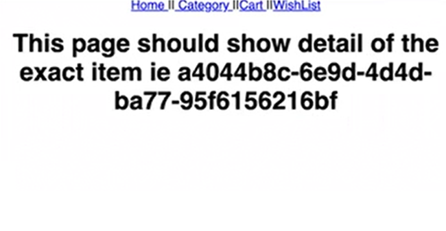

# React Router

## Setup up Process of react router


  
 
## What is a route?

Different URLs of a website are known as routes. It can either be “/” or slash with a category,

For ex,

•	www.flipcart.com/
•	www.flipcart.com/shoes
•	www.flipcart.com/shoes/mens

## What does react router does?
React router helps in displaying different component on different route without refreshing the page.

## Route Component
Route component takes 2 predefined props, path with takes a string that specifies the URL path and element with takes the component to render on that specific URL.

path: "takes up the route url"
element : "tells which component to render on that particular route url"

```JS
<Routes>
        <Route path="/" element={<Home />} />
        <Route path="/category" element={<Category />} />
        <Route path="/product/" element={<ProductDetail />} />
        <Route path="/wishlist" element={<WishList />} />
        <Route path="/cart" element={<Cart />} />
      </Routes>
```

## Adding links to navigate


### What is Link?
•	An HTML element or text can be wrapped within link that will specify that on the click of that element or text , divert to the route present within the “to” property of Link. 
•	Link can compare to "a" tag of html but instead of “ahref” property we use “to” property with Link.

***NOTE:***  There should be a predefined route with a path already before specifying the path in “to” property of Link.


```JS
export default function App() {
  return (
    <div className="App">
      <nav>
        <Link to="/"> Home </Link> ||
        <Link to="/category"> Category </Link> ||
        <Link to="/cart">Cart </Link> ||
        <Link to="/wishlist">WishList </Link>
      </nav>
      <Routes>
        <Route path="/" element={<Home />} />
        <Route path="/category" element={<Category />} />
        <Route path="/product" element={<ProductDetail />} />
        <Route path="/wishlist" element={<WishList />} />
        <Route path="/cart" element={<Cart />} />
      </Routes>
    </div>
  );
}

```


- In the above example, we have created a <nav></nav> within which we have created few Link with “to” property assigned with predefined paths.

- Let’s take the example of “/category” path, first we created a route with path “/category” with renders Category component. 

- Then we create a Link with value “Category” and “to” property with same path that was in route rendering Category component in order to match the paths, in the click of the link, the route will get redirected to “/category” which will render Category component.

## Creating Dynamic Routes

•	If a path segment starts with colon(:) then it becomes a "dynamic segment".

•	Colon specifics that the thing infront of it is a variable and it will change.


**Product.js component** 

In a category listing page, on click of view details for each product, navigate to a page which shows the details of that particular product only. The URL should be unique for each product.

```JSs
export function ProductCard({
  id,
  name,
  price,
  memory,
  currency,
  details,
  noDetail
}) {
  return (
    <li
      style={{
        padding: "1rem",
        listStyle: "none",
        margin: "1rem",
        border: "1px solid #efefef"
      }}
    >
      <div style={{ fontSize: "large" }}>
        {name} {memory} GB
      </div>
      <div>
        Price: {price} {currency}
      </div>
      {noDetail && <Link to={`/product/${id}`}> View Details </Link>}
      {!noDetail && <p> {details} </p>}
    </li>
  );
}
```

- We created a component named Category which is rendering the product array.
- We have created a Link with value “View details” and has a path “/product/${id}”.This will pass the id of particular map item into the route URL and as well as in the rendered component.
- This “to” path of LINK will now be mapped to a component and path in App.js with the help of Route component.

- Lets suppose the id of the item is 123, hence the URL will be path “/product/123” for that specific product item.

**App.js component**

```JS
export default function App() {
  return (
    <div className="App">
      <nav>
        <Link to="/"> Home </Link> ||
        <Link to="/category"> Category </Link> ||
        <Link to="/cart">Cart </Link> ||
        <Link to="/wishlist">WishList </Link>
      </nav>
      <Routes>
        <Route path="/" element={<Home />} />
        <Route path="/category" element={<Category />} />
        <Route path="/product/:productId" element={<ProductDetail />} />
        <Route path="/wishlist" element={<WishList />} />
        <Route path="/cart" element={<Cart />} />
      </Routes>
    </div>
  );
}
```

- Now in App.js , we will create a dynamic route with path “/product/:productId”. : productid signifies that productid is variable.

- The id that was used in “to” property of LINK in product.js will be stored in productid and will be passed to ProductDetail.js component as ProductDetail.js is getting rendered on “/product/:productId” route.

- Lets suppose the id of the item is 123,then the route path will be product/123 which will be mapped to the LINK in product.js and 123 id will be passed as productId to ProductDetails.js component.

**ProductDetail.js component**

```JS
import {useParams} from "react-router-dom"

export default function ProductDetail() {

const {productId} = useParams();

  return <h1> This page should show detail of the exact item ie {productId} </h1>;
}

```


- Now, in ProductDetails.js , in order to utilise the passed it, we have to make use of useParams hook by “react-router-dom.”

- We will then destructure the productId form useParams() hooks.

- Now , we can utilise the productId anywhere in the ProductDetail component.

**OUTPUT**



## NavLink and active Class

-	A NavLink is a special kind of Link that knows whether or not it is "active" or not.

-	This is useful when building a navigation menu, such as a breadcrumb or a set of tabs where you'd like to show which of them is currently selected.

-	NavLink has a style property which takes a callback function which has a default parameter called isActive.

-	isActive is true if we have clicked a specific navLink otherwise its false.

-	With the help of isActive, we can style the navLink , we can style the link that is currently active.

-	The callback function of NavLink expects an object in return which can be used in style property.


```JS
const getActiveStyle = ({ isActive }) => ({
  margin: "1rem 0",
  fontWeight: isActive ? "600" : "200",
  padding: isActive ? "1rem" : "0.5rem",
  color: isActive ? "red" : ""
});

export default function App() {
  return (
    <div className="App">
      <nav>
        <NavLink style={getActiveStyle} to="/">
          Home
        </NavLink>
        ||
        <NavLink style={getActiveStyle} to="/category">
          Category
        </NavLink>
        ||
        <NavLink style={getActiveStyle} to="/cart">
          Cart
        </NavLink>
        ||
        <NavLink style={getActiveStyle} to="/wishlist">
          WishList
        </NavLink>
      </nav>
      <Routes>
        <Route path="/" element={<Home />} />
        <Route path="/category" element={<Category />} />
        <Route path="/product/:productId" element={<ProductDetail />} />
        <Route path="/wishlist" element={<WishList />} />
        <Route path="/cart" element={<Cart />} />
      </Routes>
    </div>
  );
}
```

-	In the above example, we have created 4 NavLink namely, Home, Category, Cart, Wishlist.

-	Each of the NavLink has a style property which takes a callback function getActiveStyle which passes a default parameter called isActive.

-	When we press a particular NavLink, then the isActive is turned true and based upon it we can return the styles that we want for the active NavLink.

-	Suppose we have clicked NavLink with value category , then the output will be :

**OUTPUT**


## Conflicting Routes 

Suppose we have 2 routes :-
In the first case, we have a route with fixed path “/cart” which is rendering the Cart component.

```JS
<Route path="/cart" element={<Cart />} />
```

In second case, a dynamic route is used which is receiving “cart” as someID through the LINK this particular route is being mapped to. This route is rendering Category component.

```JS
<Route path="/:someID" element={<Category />} />
```

In both the cases the URL will become as “/cart”, so which component will be rendered?

Answer : The perfect match URL will get the priority over dynamic matched URL hence the perfect match path “/cart” will be used that will render the Cart component.

 

